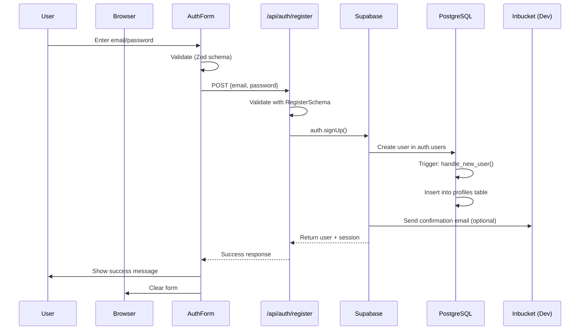
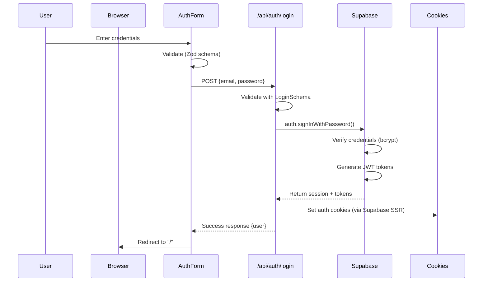
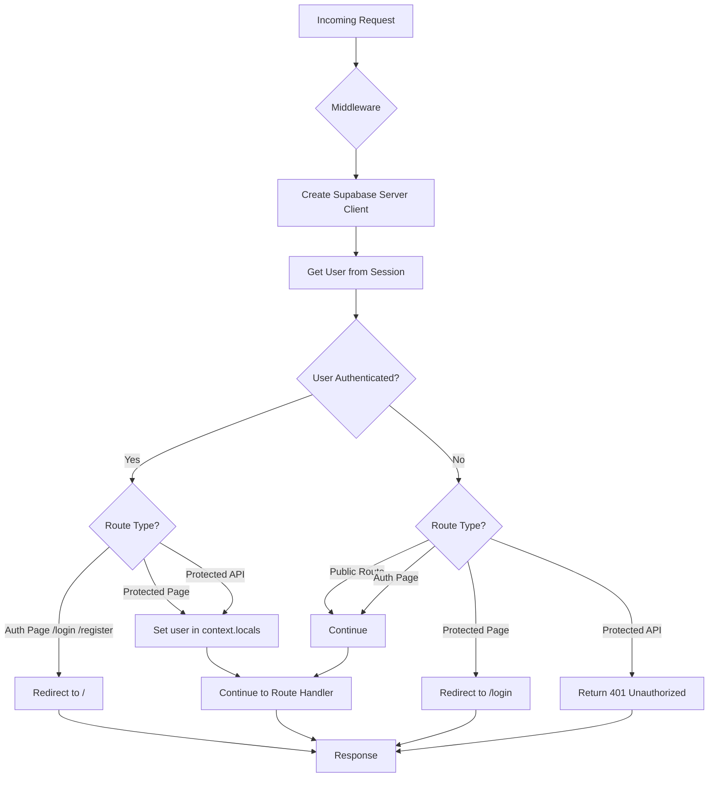
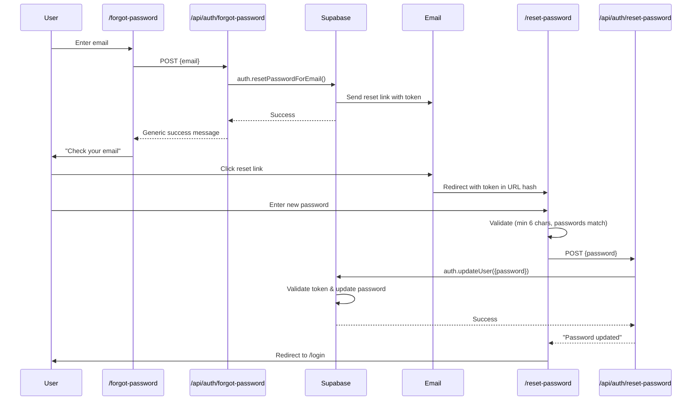

# Authentication Architecture Specification

## Overview

The Task Planner application uses Supabase Auth for user authentication and session management. This document provides a comprehensive overview of the authentication system architecture, flows, security considerations, and implementation details.

### Technologies Used

- **Supabase Auth:** JWT-based authentication service
- **@supabase/ssr:** Server-side rendering compatible authentication
- **Cookie-based sessions:** Secure session storage
- **PostgreSQL RLS:** Row Level Security for data isolation

### Authentication Methods

Currently supported:
- Email/Password authentication

Future enhancements:
- OAuth providers (Google, GitHub)
- Multi-factor authentication (MFA)

---

## Architecture Components

| Component | Type | Location | Purpose |
|-----------|------|----------|---------|
| Supabase Auth | External Service | Supabase Cloud | JWT token generation, session management, password hashing |
| Middleware | Astro Middleware | `src/middleware/index.ts` | Route protection, session validation, user context injection |
| AuthForm | React Component | `src/components/AuthForm.tsx` | Login/register UI with form validation |
| Login Page | Astro Page | `src/pages/login.astro` | Login page wrapper |
| Register Page | Astro Page | `src/pages/register.astro` | Registration page wrapper |
| Login API | Astro API Route | `src/pages/api/auth/login.ts` | Login endpoint with Zod validation |
| Register API | Astro API Route | `src/pages/api/auth/register.ts` | Registration endpoint with profile creation |
| Logout API | Astro API Route | `src/pages/api/auth/logout.ts` | Logout endpoint |
| Forgot Password API | Astro API Route | `src/pages/api/auth/forgot-password.ts` | Password reset request endpoint |
| Reset Password API | Astro API Route | `src/pages/api/auth/reset-password.ts` | Password update endpoint |
| Supabase Client | Service | `src/db/supabase.client.ts` | Supabase client factory for browser and server |
| User Menu | React Component | `src/components/UserMenu.tsx` | Authenticated user menu |

---

## Authentication Flow Diagrams

### Registration Flow



### Login Flow



### Session Management & Middleware Flow



### Password Reset Flow



---

## Implementation Details

### Authentication Methods

**Current:**
- Email/Password only
- Email confirmation disabled in development (`enable_confirmations = false`)
- Email confirmation can be enabled in production for additional security

**Password Requirements:**
- Minimum length: 6 characters
- No maximum length (Supabase default)
- Hashed using bcrypt by Supabase Auth

### Session Management

**Token Storage:**
- JWT access tokens stored in HTTP-only cookies
- Refresh tokens for automatic token renewal
- Cookie names: `sb-access-token`, `sb-refresh-token`, `sb-auth-token`

**Token Configuration:**
- Access token expiry: 3600 seconds (1 hour)
- Refresh token rotation enabled
- Reuse interval: 10 seconds (prevents token replay attacks)

**Cookie Security:**
- HttpOnly flag prevents XSS attacks
- Secure flag in production (HTTPS only)
- SameSite policy prevents CSRF attacks
- Managed automatically by @supabase/ssr

### Protected Routes

Routes are divided into three categories:

**Public Routes (no authentication required):**
```typescript
const publicRoutes = [
  "/login",
  "/register",
  "/forgot-password",
  "/reset-password",
  "/api/auth/login",
  "/api/auth/register",
  "/api/auth/logout",
  "/api/auth/forgot-password",
  "/api/auth/reset-password"
];
```

**Protected Pages:**
- All routes not in publicRoutes array
- Redirect to `/login` if not authenticated
- Examples: `/`, `/dashboard`, etc.

**Protected API Routes:**
- All `/api/*` routes except auth endpoints
- Return 401 Unauthorized if not authenticated
- Examples: `/api/tasks`, `/api/categories`, `/api/ai/suggest`

### User Context Access

**In Astro Pages:**
```typescript
const user = Astro.locals.user;
const supabase = Astro.locals.supabase;
```

**In API Routes:**
```typescript
export async function POST(context: APIContext) {
  const { user, supabase } = context.locals;

  if (!user) {
    return new Response(JSON.stringify({
      error: { message: "Authentication required", code: "UNAUTHORIZED" }
    }), { status: 401 });
  }

  // Use user.id for database queries
}
```

**In React Components:**
- Components use API endpoints
- Authentication check handled by middleware
- No direct Supabase client access in components

---

## Security Considerations

### Row Level Security (RLS)

All database tables have RLS enabled to enforce data isolation:

```sql
-- Example: tasks table RLS policies
create policy tasks_select_own on tasks
  for select
  to authenticated
  using (user_id = auth.uid());

create policy tasks_insert_own on tasks
  for insert
  to authenticated
  with check (user_id = auth.uid());

create policy tasks_update_own on tasks
  for update
  to authenticated
  using (user_id = auth.uid())
  with check (user_id = auth.uid());

create policy tasks_delete_own on tasks
  for delete
  to authenticated
  using (user_id = auth.uid());
```

**Benefits:**
- Database-level security (defense in depth)
- Automatic enforcement on all queries
- Protection against SQL injection
- Works even if application code is bypassed

### Password Security

**Storage:**
- Passwords never stored in plaintext
- Hashed using bcrypt by Supabase Auth
- Hash cost factor: 10 (Supabase default)

**Validation:**
- Minimum 6 characters (configurable)
- No password complexity requirements (NIST recommendation)
- Users should use password managers

**Reset Security:**
- Reset tokens expire after 1 hour
- Tokens are single-use
- Generic success messages prevent email enumeration
- Tokens sent via secure email link

### Session Security

**Token Management:**
- JWT tokens signed with secret key
- Tokens include user metadata and expiry
- Automatic token refresh before expiry
- Tokens validated on every request

**Cookie Security:**
- HttpOnly prevents JavaScript access
- Secure flag ensures HTTPS-only transmission
- SameSite prevents CSRF attacks
- Automatic cleanup on logout

### API Security

**Input Validation:**
- All inputs validated with Zod schemas
- Type safety at runtime and compile time
- Detailed error messages for developers
- Generic error messages for users

**Error Handling:**
- No sensitive information in error messages
- No stack traces in production
- Consistent error response format
- Proper HTTP status codes

**Rate Limiting:**
- Configured in Supabase config
- Email rate limit: 2 emails per hour
- Prevents abuse of password reset
- Protects against brute force attacks

### Email Enumeration Prevention

**Password Reset:**
- Always return success message
- Don't reveal if email exists
- Example: "If an account exists with this email, you will receive a password reset link."

**Registration:**
- Could reveal if email exists (acceptable trade-off)
- Required for user experience
- Consider implementing CAPTCHA if abuse occurs

---

## Error Handling Patterns

### Error Response Format

All API endpoints use consistent error format:

```typescript
interface ApiError {
  error: {
    message: string;
    code: string;
  };
}
```

### Error Codes

| Code | HTTP Status | Description |
|------|-------------|-------------|
| `VALIDATION_ERROR` | 400 | Invalid input data (Zod validation failed) |
| `AUTH_ERROR` | 401 | Authentication failed (invalid credentials) |
| `UNAUTHORIZED` | 401 | No authenticated user for protected route |
| `FORBIDDEN` | 403 | User doesn't have permission for resource |
| `NOT_FOUND` | 404 | Resource not found |
| `SERVICE_UNAVAILABLE` | 503 | External service not available (e.g., OpenRouter) |
| `INTERNAL_ERROR` | 500 | Unexpected server error |

### Example Error Responses

**Validation Error:**
```json
{
  "error": {
    "message": "Invalid email address",
    "code": "VALIDATION_ERROR"
  }
}
```

**Authentication Error:**
```json
{
  "error": {
    "message": "Invalid credentials",
    "code": "AUTH_ERROR"
  }
}
```

**Unauthorized Error:**
```json
{
  "error": {
    "message": "Authentication required",
    "code": "UNAUTHORIZED"
  }
}
```

---

## Configuration Reference

### Supabase Config (`supabase/config.toml`)

```toml
[auth]
site_url = "http://127.0.0.1:3000"
additional_redirect_urls = ["https://127.0.0.1:3000"]
jwt_expiry = 3600
enable_signup = true
minimum_password_length = 6

[auth.email]
enable_signup = true
enable_confirmations = false  # Disabled for development
double_confirm_changes = true
secure_password_change = false
max_frequency = "1s"
otp_length = 6
otp_expiry = 3600

[auth.rate_limit]
email_sent = 2  # Max 2 emails per hour

[inbucket]
enabled = true
port = 54324  # Local email testing
```

### Environment Variables

```env
# Required
SUPABASE_URL=https://your-project.supabase.co
SUPABASE_KEY=your-anon-key

# Optional (for AI features)
OPENROUTER_API_KEY=your-api-key

# E2E Testing
E2E_USERNAME=test@example.com
E2E_PASSWORD=test123456
```

### Validation Schemas

**Login Schema:**
```typescript
const LoginSchema = z.object({
  email: z.string().email("Invalid email address"),
  password: z.string().min(1, "Password is required"),
});
```

**Register Schema:**
```typescript
const RegisterSchema = z.object({
  email: z.string().email("Invalid email address"),
  password: z.string().min(6, "Password must be at least 6 characters"),
});
```

**Forgot Password Schema:**
```typescript
const ForgotPasswordSchema = z.object({
  email: z.string().email("Invalid email address"),
});
```

**Reset Password Schema:**
```typescript
const ResetPasswordSchema = z.object({
  password: z.string().min(6, "Password must be at least 6 characters"),
});
```

---

## Database Schema

### Profiles Table

```sql
create table profiles (
  id uuid primary key references auth.users(id) on delete cascade,
  email text not null,
  display_name text,
  created_at timestamptz not null default now(),
  updated_at timestamptz not null default now()
);

-- Enable RLS
alter table profiles enable row level security;

-- RLS Policies
create policy profiles_select_own on profiles
  for select to authenticated
  using (id = auth.uid());

create policy profiles_insert_own on profiles
  for insert to authenticated
  with check (id = auth.uid());

create policy profiles_update_own on profiles
  for update to authenticated
  using (id = auth.uid())
  with check (id = auth.uid());

create policy profiles_delete_own on profiles
  for delete to authenticated
  using (id = auth.uid());
```

### Auto-Profile Creation Trigger

Automatically creates a profile when a user signs up:

```sql
create or replace function handle_new_user()
returns trigger as $$
begin
  insert into public.profiles (id, email)
  values (new.id, new.email);
  return new;
end;
$$ language plpgsql security definer;

create trigger on_auth_user_created
  after insert on auth.users
  for each row
  execute function handle_new_user();
```

**Security Note:** Function uses `security definer` to run with elevated privileges, allowing it to insert into profiles table even though the trigger runs in auth schema.

---

## Testing

### Local Email Testing

**Inbucket:**
- URL: http://localhost:54324
- Captures all emails sent in development
- No actual emails sent to real addresses
- Useful for testing registration and password reset flows

### Manual Testing Checklist

**Registration:**
- [ ] Valid email and password creates account
- [ ] Invalid email shows error
- [ ] Short password shows error
- [ ] Duplicate email shows error
- [ ] Profile created in database
- [ ] Confirmation email sent (if enabled)

**Login:**
- [ ] Valid credentials logs in successfully
- [ ] Invalid credentials shows error
- [ ] Redirects to homepage after login
- [ ] Session cookie set correctly
- [ ] Already logged in redirects to homepage

**Logout:**
- [ ] Logout clears session
- [ ] Redirects to login page
- [ ] Cannot access protected routes
- [ ] Can log in again

**Password Reset:**
- [ ] Forgot password sends email
- [ ] Reset link works
- [ ] Token expires after 1 hour
- [ ] New password works
- [ ] Old password doesn't work

**Middleware:**
- [ ] Protected pages require login
- [ ] Protected APIs return 401
- [ ] Public routes accessible without login
- [ ] Auth pages redirect when logged in

---

## Future Enhancements

### OAuth Providers

**Planned:**
- Google OAuth
- GitHub OAuth
- Microsoft OAuth

**Configuration:**
```toml
[auth.external.google]
enabled = true
client_id = "env(GOOGLE_CLIENT_ID)"
secret = "env(GOOGLE_CLIENT_SECRET)"
redirect_uri = "http://localhost:3000/auth/callback"
```

### Multi-Factor Authentication (MFA)

**Options:**
- TOTP (Time-based One-Time Password)
- SMS verification
- Email verification codes

**Configuration:**
```toml
[auth.mfa]
enabled = true
max_enrolled_factors = 10
```

### Email Confirmation

Enable in production for additional security:

```toml
[auth.email]
enable_confirmations = true
```

**Flow:**
1. User registers
2. Email sent with confirmation link
3. User clicks link
4. Account activated
5. User can log in

### Session Management UI

**Features:**
- View active sessions
- Revoke sessions
- Device information
- Location tracking

### Account Deletion

**Implementation:**
- Self-service account deletion
- Cascade delete all user data
- Retention period option
- GDPR compliance

---

## Troubleshooting

### Common Issues

**Issue:** "Invalid login credentials"
- **Cause:** Wrong email or password
- **Solution:** Verify credentials, use password reset if forgotten

**Issue:** Session expired
- **Cause:** Access token expired (1 hour)
- **Solution:** Refresh token should auto-renew, otherwise re-login

**Issue:** Emails not received
- **Cause:** Email service not configured
- **Solution:** Check Inbucket (dev) or SMTP settings (prod)

**Issue:** "Row Level Security policy violation"
- **Cause:** Trying to access another user's data
- **Solution:** Verify user_id filtering in queries

**Issue:** Middleware redirect loop
- **Cause:** Protected route misconfiguration
- **Solution:** Check publicRoutes array in middleware

---

## References

- [Supabase Auth Documentation](https://supabase.com/docs/guides/auth)
- [Supabase SSR Package](https://supabase.com/docs/guides/auth/server-side/overview)
- [Astro Middleware](https://docs.astro.build/en/guides/middleware/)
- [Zod Validation](https://zod.dev/)
- [OWASP Authentication Cheat Sheet](https://cheatsheetseries.owasp.org/cheatsheets/Authentication_Cheat_Sheet.html)
